# RimRid Shopping

An e-commerce shopping app built with **Flutter**, with real product data from a live free API, real network authentication, and full on-device persistence for cart, wishlist, orders, and login sessions.

## Screenshots

<table>
  <tr>
    <td align="center" width="25%">
      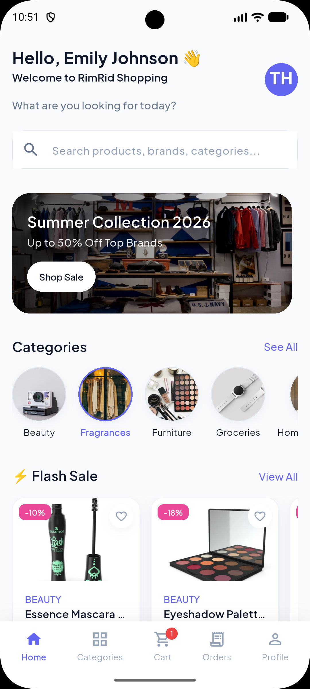<br/>
      <sub><b>Home</b></sub>
    </td>
    <td align="center" width="25%">
      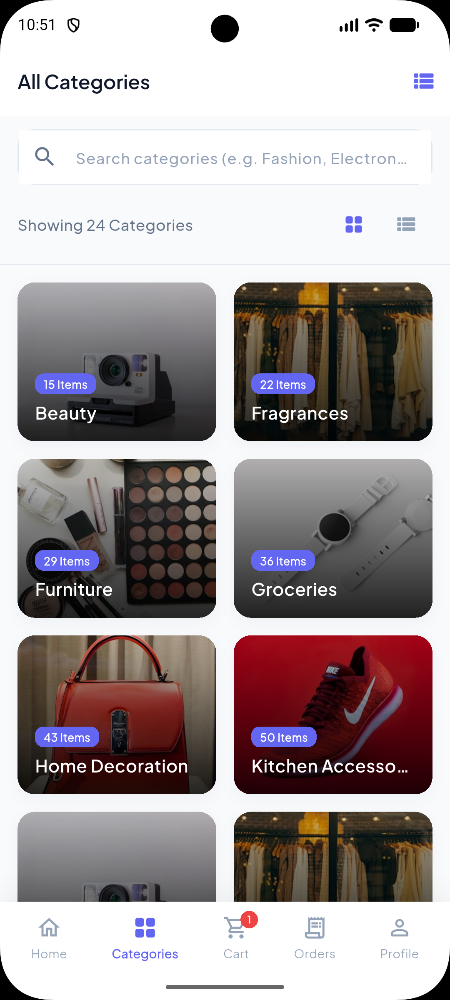<br/>
      <sub><b>Categories</b></sub>
    </td>
    <td align="center" width="25%">
      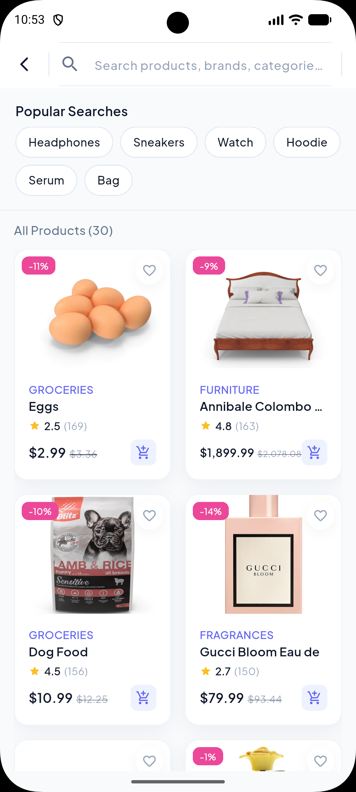<br/>
      <sub><b>Search</b></sub>
    </td>
    <td align="center" width="25%">
      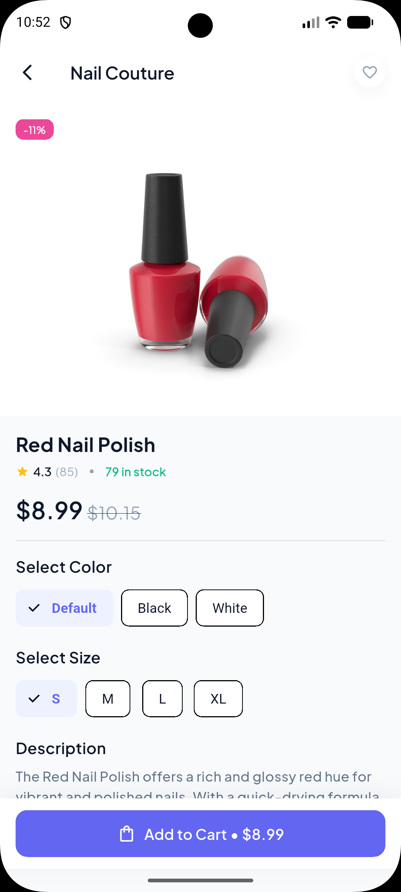<br/>
      <sub><b>Product Details</b></sub>
    </td>
  </tr>
  <tr>
    <td align="center">
      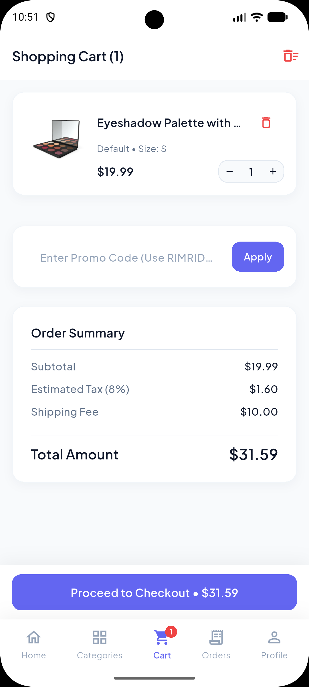<br/>
      <sub><b>Cart</b></sub>
    </td>
    <td align="center">
      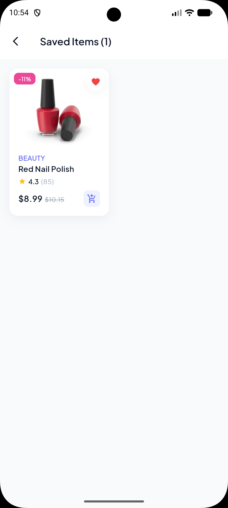<br/>
      <sub><b>Wishlist</b></sub>
    </td>
    <td align="center">
      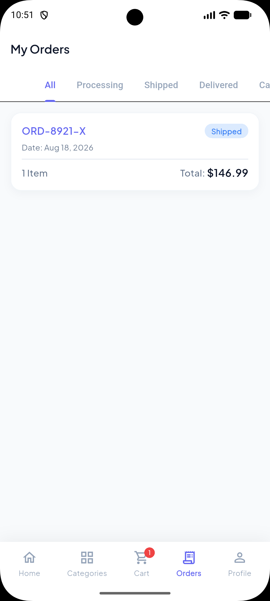<br/>
      <sub><b>Orders</b></sub>
    </td>
    <td align="center">
      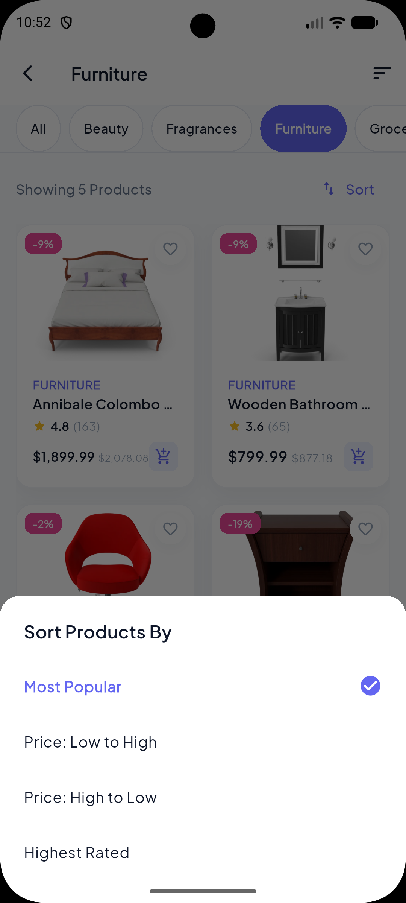<br/>
      <sub><b>Sort & Filter</b></sub>
    </td>
  </tr>
  <tr>
    <td align="center">
      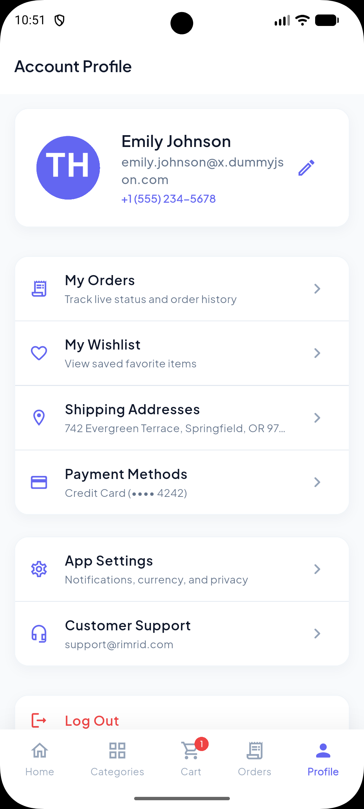<br/>
      <sub><b>Profile</b></sub>
    </td>
    <td align="center">
      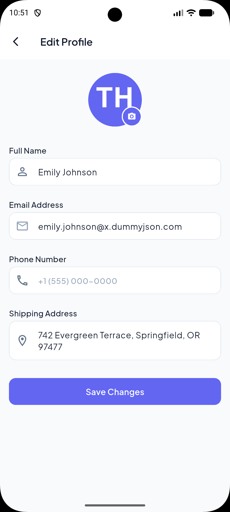<br/>
      <sub><b>Edit Profile</b></sub>
    </td>
    <td align="center">
      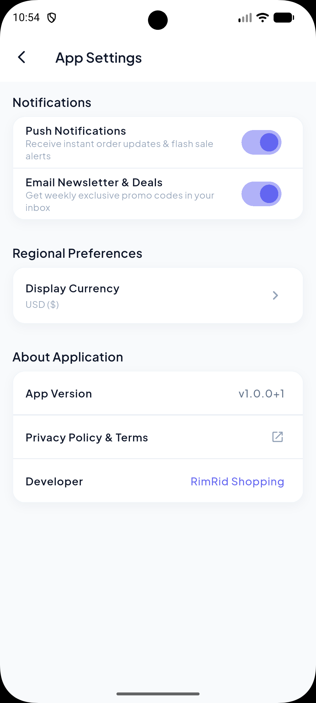<br/>
      <sub><b>App Settings</b></sub>
    </td>
    <td align="center">
      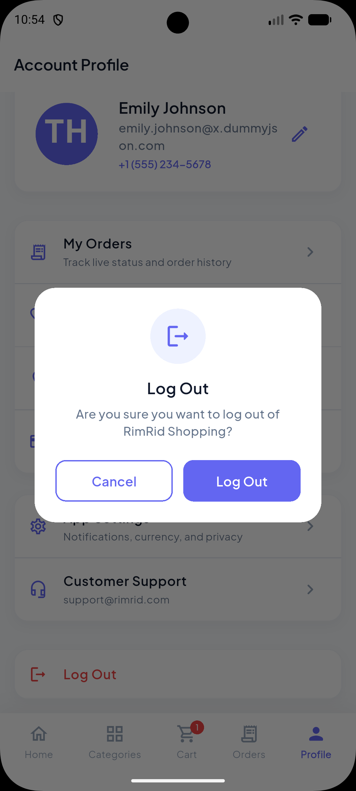<br/>
      <sub><b>Log Out</b></sub>
    </td>
  </tr>
</table>

## Features

- **Product catalog** — live products, categories, and search powered by the free [DummyJSON](https://dummyjson.com) API, with flash sale badges, ratings, and stock counts.
- **Real authentication** — sign in over the network against DummyJSON's `/auth/login`, or sign up for a real, locally-persisted account (SHA-256 hashed password) that you can genuinely log back into. Guest mode available with no network call.
- **Cart & checkout** — variant selection, quantity controls, promo codes, tax/shipping calculation, and order placement.
- **Wishlist** — save and manage favorite products.
- **Order history** — track past orders by status (processing, shipped, delivered, cancelled).
- **Editable profile** — update your name, phone, and shipping address, and set a profile photo from your device's gallery. Email stays locked for account integrity.
- **Full persistence** — cart, wishlist, orders, onboarding state, and your login session are all stored on-device with [Hive](https://pub.dev/packages/hive) and survive a full app restart.

## Tech Stack

| Layer | Choice |
|---|---|
| Framework | Flutter |
| State management | Provider |
| Routing | go_router |
| Local storage | Hive |
| Networking | http |
| Auth | DummyJSON `/auth/login` (real accounts) + local hybrid store (self-service signup) |
| Image picking | image_picker |
| Fonts | google_fonts |

## Project Structure

```
lib/
  core/                 # theme, routing, shared widgets, services, utils
  features/
    auth/                # login, signup, session
    home/ categories/ products/   # catalog browsing
    cart/ checkout/ orders/       # purchase flow
    wishlist/ profile/ settings/  # account
```

Each feature follows a `models / providers / repositories / screens` layout.

## Getting Started

```bash
flutter pub get
flutter run
```

Demo login: `emilys` / `emilyspass` (a DummyJSON test account), or sign up for your own account, or tap **Continue as Guest**.

## A Note on Auth

DummyJSON's `/users/add` signup endpoint is a mock — it doesn't persist accounts server-side. To make self-service signup genuinely work, new accounts are stored locally on-device (password hashed, never in plaintext) and checked first on login, falling back to DummyJSON's real `/auth/login` for its fixed demo accounts. This means a signed-up account can log back in on the same device, but won't be recognized on a different install — an inherent limit of building real auth on top of a free public API.
